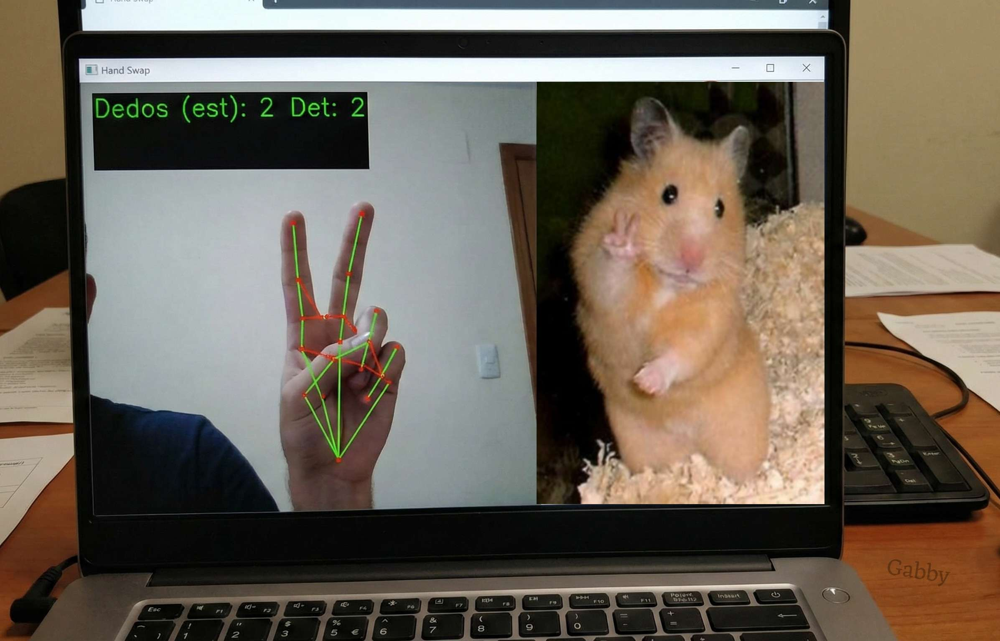

# KeniaGabrielaFrutosGonzalez-IA_P3PF
# 🖐️ Hand Swap | Detector de Gestos & Swap de Imágenes


> **Proyecto Final - Inteligencia Artificial**
>
> Una aplicación interactiva que detecta la cantidad de dedos levantados en tiempo real y responde mostrando imágenes personalizadas. ¡Sin necesidad de contacto!

<div align="center">
  <br>
  
  
  
  <br>

  <p><i>Demostración: Detectando el gesto de "Amor y Paz" (2 dedos) e intercambiando la imagen en tiempo real.</i></p>
</div>
<br>

## ¿Qué hace este proyecto?

Este software utiliza la cámara web para leer el lenguaje corporal (específicamente la mano). Mediante algoritmos de visión artificial, realiza lo siguiente:

1.  **Detecta la mano** y sus 21 puntos clave (landmarks).
2.  **Cuenta los dedos** activos analizando la geometría de las articulaciones.
3.  **Estabiliza la señal** para evitar parpadeos erróneos.
4.  **Muestra una imagen** (en este caso son imagenes de hamsters) asociada a la cantidad de dedos detectados.

## Tecnologías Implementadas

* **Python:** Lenguaje principal.
* **MediaPipe (Google):** Para la extracción de landmarks de la mano con alta precisión.
* **OpenCV:** Para el procesamiento de imágenes y captura de video.
* **NumPy:** Para cálculos matriciales y manejo de arrays.
* **Collections (Deque):** Para el algoritmo de suavizado temporal (estabilización).

---

## Requisitos Previos
Antes de empezar, asegúrate de tener instalado Python en tu computadora. Esta version funciona con **Python 10.**


Necesitaras crear un entorno virtual.

```bash
py -3.10 -m venv venv_final #primero este

.\venv_final\Scripts\activate #despúes este
```

Necesitarás las siguientes librerías:

```bash
pip install opencv-python mediapipe numpy
```


## Configuracion de archivos
Para que el script **hand_swap.py** funcione, es obligatorio tener las imágenes en la misma carpeta del proyecto. El programa buscará sus nombres exactos así que asegurate de cambiarlos si es necesario.

**Nota:** Si falta alguna de las imágenes, el programa mostrará un error en la consola y se cerrará automáticamente para evitar fallos mayores.

## Como ejecutar
1. Clona este repositorio o descarga el código.
2. Asegúrate de que tus imágenes (.jpg) estén junto al archivo .py.
3. Abre tu terminal en la carpeta del proyecto.
4. Ejecuta:
```bash
python hand_swap.py
```
5. Se abrirá una ventana con tu cámara. Empieza a hacer gestos con la mano.

6. Para salir, presiona la tecla q.

## Explicación técnica breve
**Lógica de Conteo**

El algoritmo compara la coordenada Y de la punta del dedo (tip) con la coordenada Y de la articulación media (pip).

- Si Punta < Articulación (en coordenadas de pantalla, arriba es menor valor), el dedo cuenta como abierto.

- Para el Pulgar, se utiliza una lógica especial basada en la coordenada X dependiendo de si es mano izquierda o derecha.

**Estabilización**

Se implementó un buffer histórico (deque de tamaño 7). El programa no toma la decisión instantánea, sino que analiza los últimos 7 cuadros de video y elige la cantidad de dedos más frecuente (Counter). Esto elimina el "ruido" si la mano tiembla un poco.

## Créditos y referencias

- Documentación Oficial: [MediaPipeHands](https://ai.google.dev/edge/mediapipe/solutions/vision/hand_landmarker?hl=es-419)

- Lógica base: Tutorial ["Hand controlled media player"](https://youtu.be/NGEyIfX4GGk?si=bs_qY2sR-AomFWUX) del canal [ProgrammingHut](https://www.youtube.com/@programming_hut)

- Inspiración visual:  Contenido de instagram de [holasoymalva](https://www.instagram.com/reel/DRnevoCkcbE/?igsh=eHBkbWN6czB3Y2J1)

<br>

#

<br>

<div align="center"> <p>Hecho con 💜 por una futura Ingeniera en Mecatrónica</p> <p>2025</p> </div>
